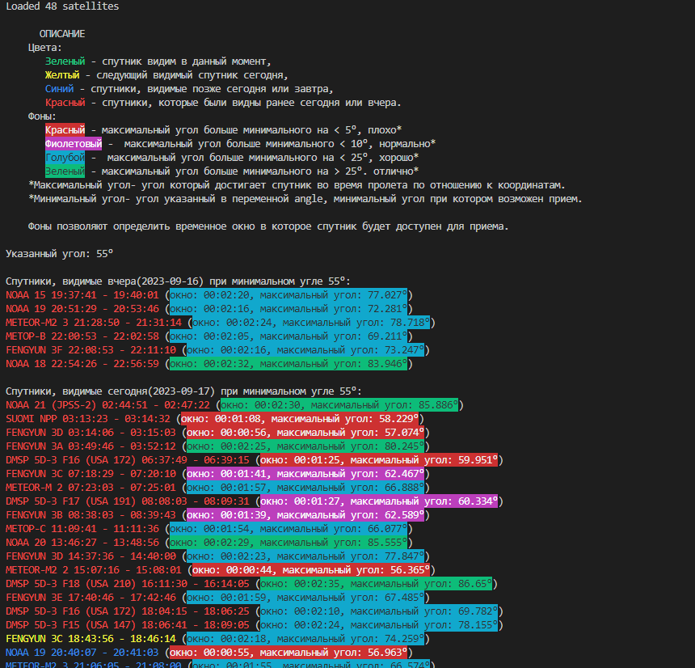

# availability_of_weather_satellites
Определение времени, когда метеорологические спутники будут доступны для приема.  
Работает offline.  

### Для работы программы необходимо ввести в data.json:
longitude (долгота)
latitude (широта)
angle (минимально возможный угол наблюдения спутника)

### Интерфейс программы

